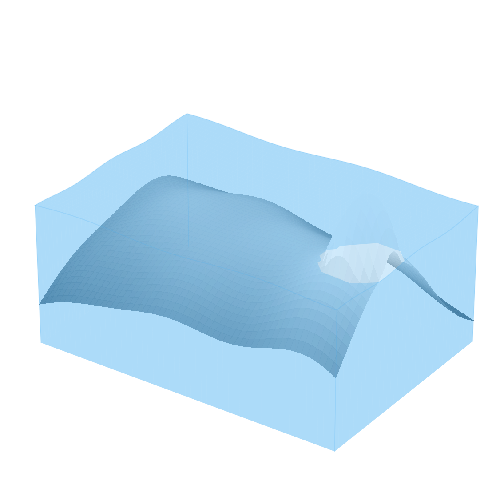

# 红外温度 3D 浸泡示意图

这是一个带中文 GUI 的桌面脚本，用红外 TXT 像素温度生成可拖动的 3D illustration。物体采用石墨灰表面，水体采用带轻微波纹的半透明蓝色表面；预览中的坐标轴默认隐藏。



## 下载 Windows 版本

无需安装 Python，可从 [GitHub Releases](https://github.com/ta1krelax/infrared-3d-viewer/releases/latest) 下载最新的 Windows x64 EXE 或 ZIP 分享包。

## 启动

Windows 下双击 `run_gui.bat`。脚本会优先使用 `py -3`，缺少组件时自动安装 `requirements.txt` 中的依赖。

无需 Python 的 v1.10 分享版本位于 `release/Infrared3DViewer_v1.10.exe`；压缩分享包为
`release/Infrared3DViewer_v1.10_Windows_x64.zip`。如需重新打包，双击 `build_exe.bat`。

也可以在命令行运行：

```powershell
py -3 -m pip install -r requirements.txt
py -3 app.py
```

程序启动后会先显示内置示例。点击“读取 TXT / TIFF”选择自己的数据，左键拖动旋转，滚轮缩放；调整参数后预览会自动刷新。导出 PNG 或 TIFF 时会保留当前视角。

也可以把 TXT/TIFF 文件拖到 EXE 上，程序会直接读取该文件。

## 支持的 TXT 格式

推荐使用一个文件对应一个温度帧。

二维温度矩阵（空格、逗号、分号或 Tab 均可）：

```text
24.10 24.20 24.35
24.12 24.52 25.10
24.08 24.30 24.76
```

也支持完整的 `X, Y, temperature` 三列规则网格：

```text
0,0,24.10
1,0,24.20
0,1,24.12
1,1,24.52
```

以 `#` 或 `//` 开始的行内注释会被忽略；普通文字表头也会被忽略。默认单像素尺寸为 `0.01 mm`。

## 支持的 TIFF 格式

支持 8-bit、16-bit 整数、16-bit 浮点和 32-bit 浮点灰度 TIFF，并保留文件中的原始数值。RGB TIFF 会按亮度转换为二维数据；多页 TIFF 默认读取第一帧。压缩 TIFF 由 `imagecodecs` 支持。

## 材质、玻璃水体与渐变

- 水上样品和水下样品可以分别调整基础颜色、亮度及不透明度。
- 样品网格可开关，并可设置每个方向的线数。
- 固体裁切侧壁默认不创建，避免边缘峰值产生灰色竖直面及透明多边形深度排序遮挡；需要时可通过“显示固体侧壁（裁切面）”重新启用。
- 水体由波纹顶面和四个周边侧壁构成三维玻璃体；水色、亮度、不透明度及轮廓高光均可调整。
- 水体的 X/Y 外轮廓与固体完全重合，不再向四周扩展；高于水面的样品区域会在水面自动开孔。
- 水体顶面、侧壁、样品和网格合并为同一个逐面片深度排序场景。完全藏在样品下方的水平水底面不再创建，避免其巨大半透明面片在正面俯仰视角下错误覆盖露出水面的白色固体；四周侧壁仍保留完整的三维水体外观。
- 顶部白化渐变按原始温度/强度归一化，最高值可过渡到白色。白化强度和 γ 曲线可调；γ 越大，白色越集中在峰顶。

## 水面边界细化

“细化一次”始终处理当前裁剪区域的原始数据副本，不会覆盖源数据。每次细化会把网格的两个方向都扩展为 `2n−1`：跨越水面的相邻点插入精确水面阈值，未跨越的相邻点插入平均值。修改浸泡比例后，所有细化层级会按新水面重新构建。

细化后的网格不会再被预览降采样，以免丢掉新插入的水面边界点。为控制 CPU 渲染和内存占用，最多细化 6 次且最终网格不超过 90,000 点。

## 整体显示比例

X、Y、Z 显示比例可以独立设置，且只改变画面纵横比。“扁平长方体预设”为 `X=3`、`Y=1`、`Z=0.12`，也可以自行输入其它比例。

## 视角预设

“视角预设”下拉菜单包含原有透视视角，以及正交正视、后视、左视、右视、俯视、等轴测和反向等轴测。投影模式也可独立选择“透视投影”或“正交投影”。

所有视角统一显示为可输入的样品 `X / Y / Z` 旋转角和视图缩放百分比：`0° / 0° / 0°` 为正视，X 为俯仰，Y 为水平旋转，Z 为画面滚转，缩放范围为 20%–300%。选择预设会回填这些数值；左键拖动后的角度和滚轮缩放后的比例也会同步回 GUI，因此同一组数字可以精确复现并导出同一视角。“重置视角”恢复常规透视及 100% 缩放。

## 中央 1/3

默认在 X 和 Y 两个方向都保留中央 1/3 区域。例如 `120 × 90` 的图像会保留约 `40 × 30` 的中央区域。GUI 也可以改成仅截 X、仅截 Y 或不截取。

## 浸泡与红外吸收模型

设原始最低、最高温度为 `Tmin`、`Tmax`，浸泡比例为 `p`：

```text
T水面 = Tmin + p × (Tmax − Tmin)
```

原始温度低于 `T水面` 的像素视为水下。设吸收比例为 `a`，水下显示高度为：

```text
Z显示 = T水面 + (T原始 − T水面) × (1 − a)
```

水上区域保持原高度。例如 `Tmin=24°C`、`Tmax=26°C`、浸泡 `90%`、吸收 `80%`，水面为 `25.8°C`，原来 `24°C` 的位置显示为 `25.44°C`；`26°C` 的区域仍为 `26°C`。

“垂直显示倍率”只影响 3D 画面的视觉纵横比，不改变上述数值模型。

## 导出

- PNG：适合幻灯片、论文草图和快速截图。
- TIFF：LZW 无损压缩，适合后续排版。
- “导出透明背景（PNG / TIFF）”默认开启，导出 RGBA 图像且背景 Alpha 为 0；样品、水体和抗锯齿边缘保留自身透明度。关闭后恢复预览中的浅色背景。
- “同时导出当前裁剪范围的源数据副本”默认开启。导出图像时会在同一目录保存 `图像名_cropped_source` 数据文件；TXT/CSV/DAT 保存二维数值矩阵，TIFF 保存为可重新读取的 32-bit float TIFF。若同名文件已存在，会自动添加 `_2`、`_3`，不会覆盖已有数据。
- DPI 可在 GUI 中设置，默认 300。

对于很大的数据，预览会自动等距降采样到最多 `160 × 160` 个显示点，以保证拖动顺畅；计算阈值和界面统计仍使用完整的裁剪后数据。当前 Matplotlib/TkAgg 后端使用 CPU，不能直接启用 GPU；如真实大尺寸数据仍不流畅，可以另做基于 PyVista/VTK 的 GPU 版本，但 EXE 体积会明显增加。
